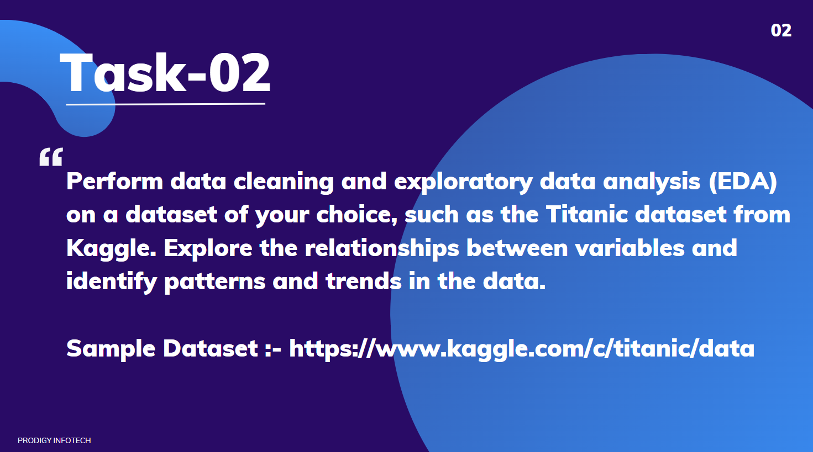

# Prodigy InfoTech Data Science Internship Task 2  
 

### 📝 Welcome to Task 2 Submission!  
This repository contains the code and analysis for Task 2 of my Data Science internship at **Prodigy InfoTech**. For this task, I performed data cleaning and exploratory data analysis (EDA) on a dataset of my choice. I selected the **Titanic dataset** from Kaggle for this analysis.  

# Task-02 Data Cleaning and Exploratory Data Analysis (EDA)  

### 💡 **Objective**:  

The objective of Task 2 was to perform data cleaning and exploratory data analysis (EDA) on a dataset to gain insights into its variables. Using the Titanic dataset, I explored relationships between key factors such as gender, passenger class, age, fare, and survival rates, uncovering patterns and trends through visualizations.

### 📂 Dataset  
[ Titanic-Dataset.csv ] The dataset is a widely-used dataset in data science, containing passenger details such as demographics and survival status. This dataset offers an excellent opportunity to explore data analysis techniques and gain meaningful insights into historical data.  

---

### 🎯 Task Description  
The primary objective of this task was to:  
1. Perform **data cleaning** by handling missing values and duplicates.  
2. Conduct **exploratory data analysis (EDA)** to identify patterns, trends, and relationships between variables.  

---

### 🔍 Analysis Highlights  
- Conducted data cleaning to handle missing values and remove duplicates.  
- Explored relationships between variables such as **gender**, **passenger class**, **age**, **fare**, and **survival rate**.  
- Key insights include:  
  - Higher survival rates among females.  
  - Impact of passenger class on survival (first-class passengers had higher survival rates).  
  - Relationship between age and survival.  

---

### 📊 Conclusion  
The data cleaning and EDA on the Titanic dataset revealed valuable insights into the factors influencing survival rates during the Titanic disaster. This analysis demonstrates the application of data science techniques in deriving meaningful insights from data and highlights historical patterns.  

---

### 🛠️ Tech Stack  
- **Language**: Python  
- **Libraries**: Pandas, Matplotlib, Seaborn, Numpy  

---
